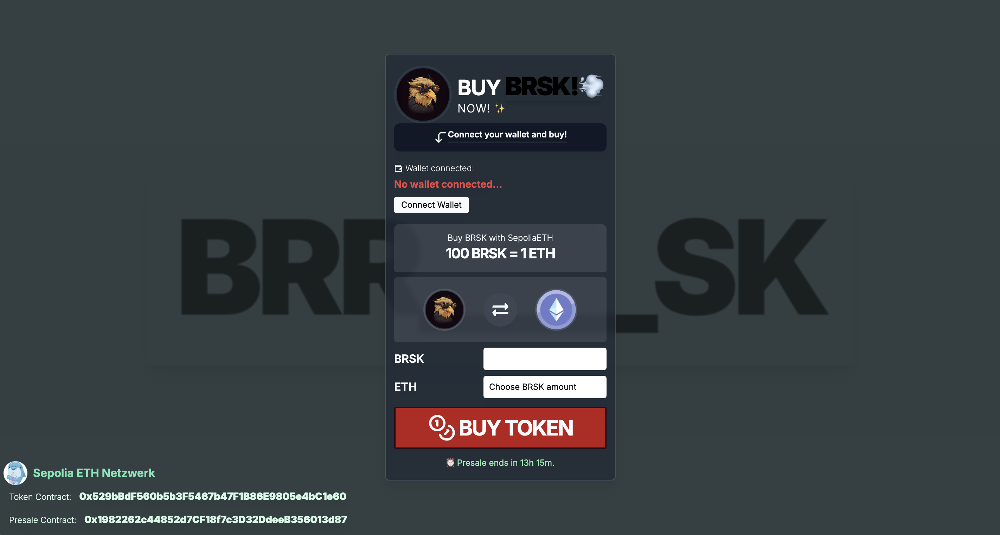

## Token Contract Address
```shell
0x28192B9789f172049EfE5BCF31FB5A013479808b
```
## Presale Contract Address
```shell
0x598cd203A95f14e8b049BA1913032A89C4777EAF
```

## Token Source
```solidity
// SPDX-License-Identifier: MIT
pragma solidity ^0.8.26;

import "@openzeppelin/contracts/token/ERC20/ERC20.sol";

contract BRSK is ERC20 {
    constructor(uint256 initialSupply) ERC20("BRSK", "BRSK") {
        _mint(msg.sender, initialSupply);
    }
}
```

## Presale Source
```solidity
// SPDX-License-Identifier: MIT
pragma solidity ^0.8.26;

import "@openzeppelin/contracts/token/ERC20/IERC20.sol";

contract Presale {
    address public owner;
    IERC20 public token;
    uint256 public rate;
    uint256 public startTime;
    uint256 public endTime;
    mapping(address => uint256) public contributions;

    modifier onlyOwner() {
        require(msg.sender == owner, "Not the contract owner");
        _;
    }

    constructor(address _tokenAddress, uint256 _rate, uint256 _startTime, uint256 _endTime) {
        require(_startTime < _endTime, "Invalid time period");
        owner = msg.sender;
        token = IERC20(_tokenAddress);
        rate = _rate;
        startTime = _startTime;
        endTime = _endTime;
    }

    function buyTokens() public payable {
        require(block.timestamp >= startTime && block.timestamp <= endTime, "Presale not active");
        uint256 tokenAmount = msg.value * rate;
        contributions[msg.sender] += tokenAmount;
    }

    function withdrawFunds() public onlyOwner {
        require(block.timestamp > endTime, "Presale not ended");
        payable(owner).transfer(address(this).balance);
    }

    function claimTokens() public {
        require(block.timestamp > endTime, "Presale not ended");
        uint256 amount = contributions[msg.sender];
        require(amount > 0, "No tokens to claim");
        contributions[msg.sender] = 0;
        require(token.transfer(msg.sender, amount), "Token transfer failed");
    }

    function endPresale() public onlyOwner {
        require(block.timestamp >= endTime, "Presale not ended");
        uint256 remainingTokens = token.balanceOf(address(this));
        require(token.transfer(owner, remainingTokens), "Transfer of remaining tokens to owner failed");
    }
}
```

## Deploy Script
```solidity
// SPDX-License-Identifier: MIT
pragma solidity ^0.8.26;

import "forge-std/Script.sol";
import "../src/BRSK.sol";
import "../src/Presale.sol";

contract Deploy is Script {
    function run() external {
        uint256 deployerPrivateKey = vm.envUint("PRIVATE_KEY");
        vm.startBroadcast(deployerPrivateKey);

        BRSK token = new BRSK(1000000 * 10 ** 18); // 1 million tokens
        uint256 rate = 250; // 1 ETH = 250 BRSK
        uint256 startTime = block.timestamp + 60; // Presale starts in 1 minute
        uint256 endTime = startTime + 10 days; // Presale lasts 10 days
        Presale presale = new Presale(address(token), rate, startTime, endTime);

        token.transfer(address(presale), 150000 * 10 ** 18); // 150,000 tokens to presale contract

        vm.stopBroadcast();
    }
}
```

## Test
Hier den Presale testen [BRSK-Token][1].

[1]: https://www.brsk-token.com/


